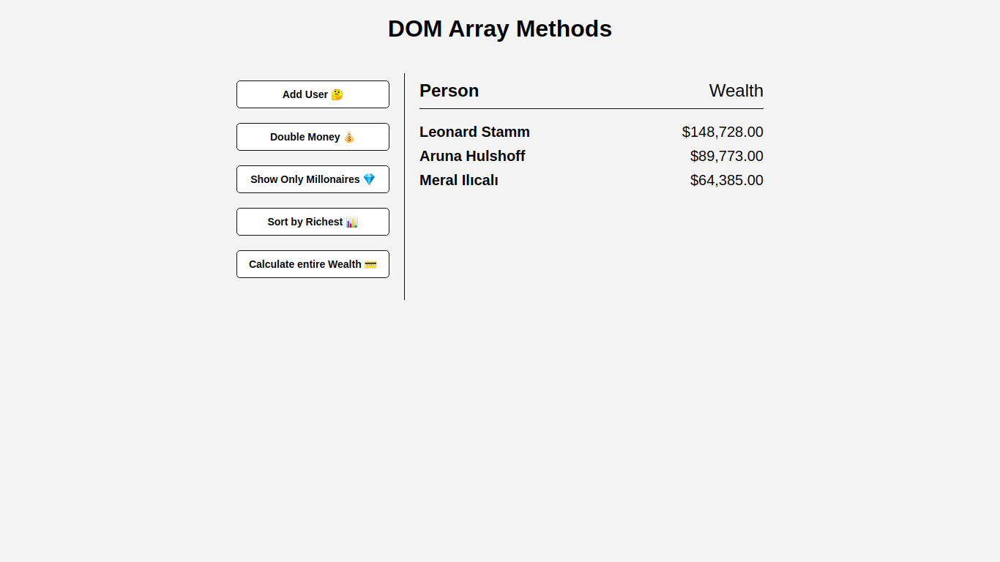
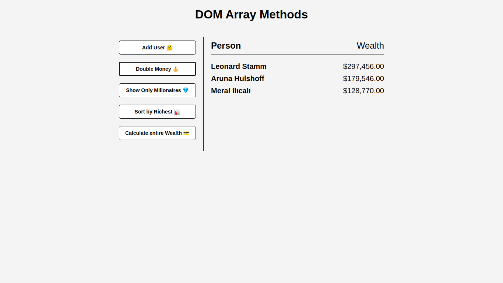
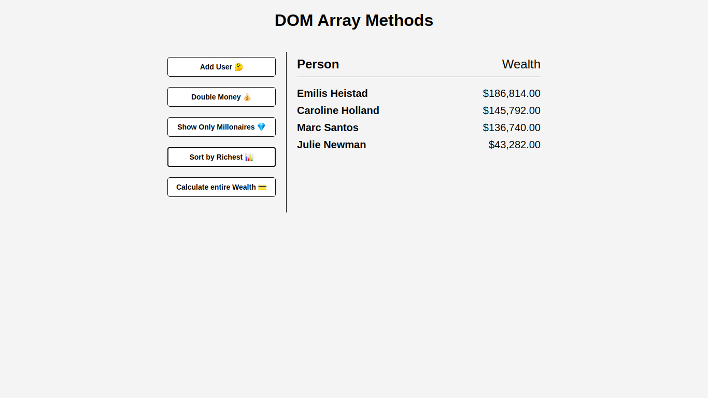
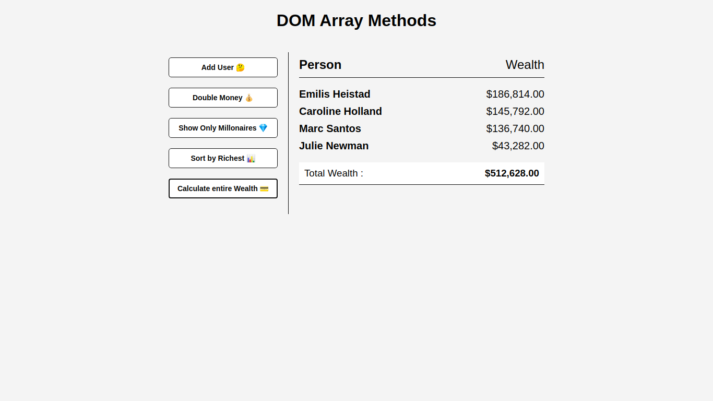

# 1. DOM-Array
    1. This Project is Leaning DOM-Array-Methods
    2. Using forEach, map, filter, reduce

# 2. Product


[Add User]



[Double Money]



[Sort By Millonaires]



[Calculate Wealth]



# 3. Function

## 1. Get Random Money and User-Name

```Javascript
async function getRandomUser(){
    const res =  await fetch('https://randomuser.me/api');
    const data = await res.json();

    const user = data.results[0];
    const newUser = {
        name:`${user.name.first} ${user.name.last}`,
        money: Math.floor(Math.random() * 1000000)
    };
    console.log(newUser)
}
getRandomUser();
```

> 
    https://randomuser.me/api 에서 사용자 정보를 가져온다.

## 2. Update Money and User-Name

```Javascript
function updateDOM(provideData = data){
    // clear main div
    main.innerHTML = '<h2><strong>Person</strong>Wealth</h2>';
    provideData.forEach(item=> {
        const element = document.createElement('div');
        element.classList.add('person');
        element.innerHTML = `<strong>${item.name}</strong> ${formatMoney(item.money)}`;
        main.appendChild(element);
    });
}

// Format number as money
function formatMoney(number){
    return '$' + number.toFixed(2).replace(/\d(?=(\d{3})+\.)/g, '$&,');
}
```

> 
    1. 가져온 사용자 정보 중 이름과 돈을 HTMl에 전달한다.
    2. 이 때 돈을 정규식표현으로 처리하여 3자리씩 ','를 적용하여 전달한다.

## 3. Double Money

```Javascript
// Double Money
function doubleMoney(){
    data = data.map((user) => {
        return { ...user , money:user.money * 2}
    });
    updateDOM();
}

```
>   
    1. data 배열에 있는 값을 가져와 다시 재할당 후 updateDOM() 함수를 실행한다.
    2. 이때 user.money 값을 2배로 변경하여 전달한다.

## 4. Sort By Richest

```Javascript
// Sort By Richest
function sortByRichest() {
    data.sort((a,b) => b.money - a.money);
    updateDOM();
}
```
>
    1. data 배열에 있는 값을 가져와 다시 재할당 후 updateDOM() 함수를 실행한다.