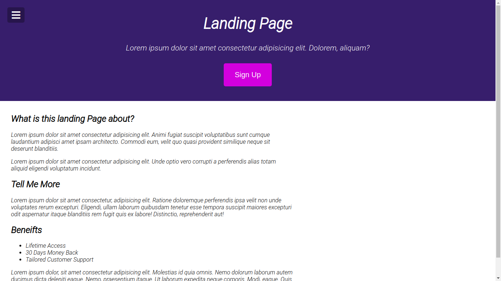
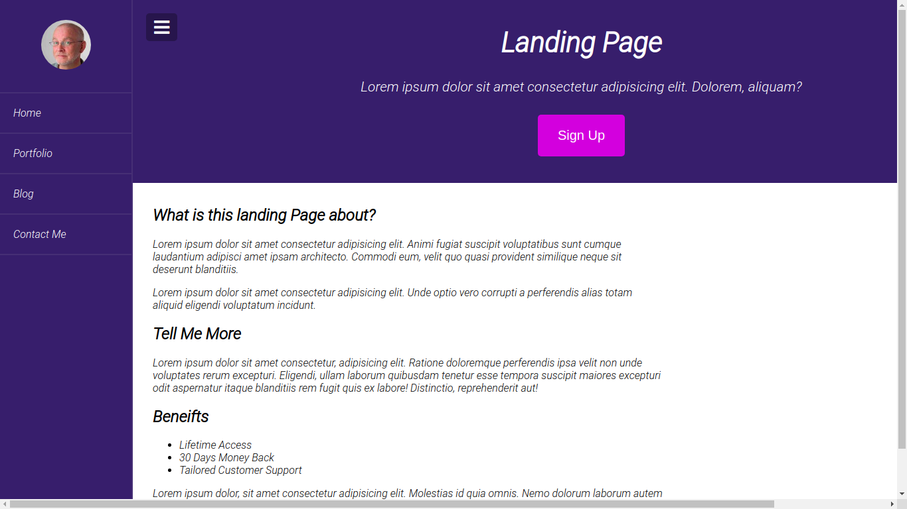
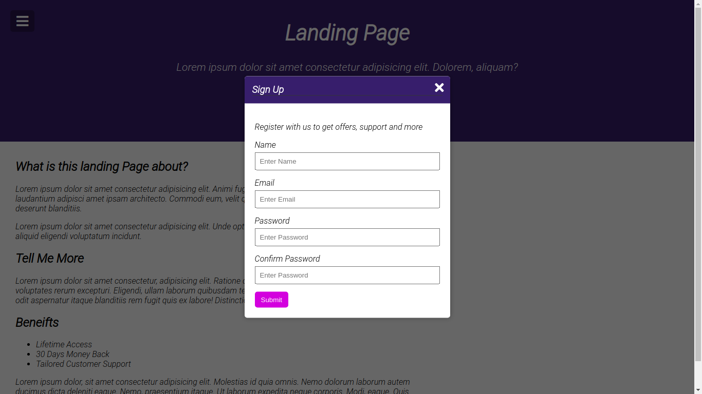

# 1. Modal-Menu Project
    1. Making Sidebar And Modal-login
    2. Need a Hard CSS

# 2. Product
[Main]



[Menu]



[Modal]



# 3. Functions

```Javascript
// Toggle nav
toggle.addEventListener('click', () => {
    document.body.classList.toggle('show-nav')
});

//show modal
open.addEventListener('click', ()=> {
    modal.classList.add('show-modal');
})

//Hide modal
close.addEventListener('click', ()=>{
    modal.classList.remove('show-modal');
})
//Hide modal outside window
window.addEventListener('click', (e)=> {
    e.target == modal ? modal.classList.remove('show-modal') : false
})
```